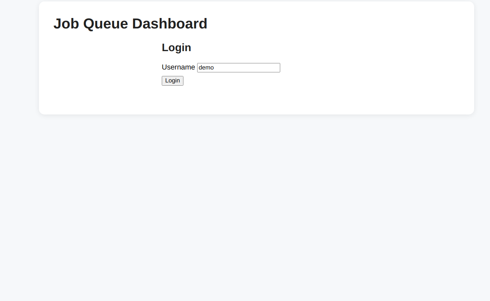
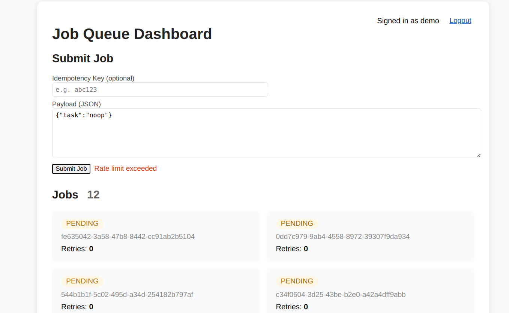
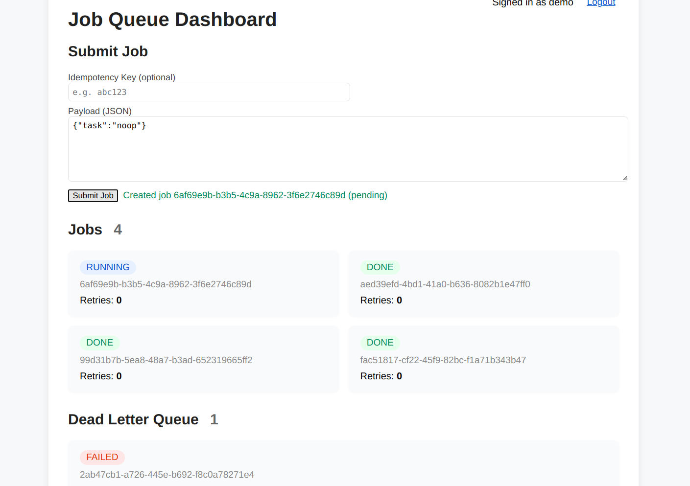

# Distributed Task Queue & Job Processor

## Overview
A prototype distributed job queue system with REST API, worker process, SQLite persistence, and a simple dashboard.

## Components
- `api.py`: REST API server (Flask)
- `worker.py`: Worker process for job execution
- `models.py`: Job and DLQ dataclasses
- `db.py`: DB helper functions
- `dashboard/`: HTML+JS dashboard
- `jobs.db`: SQLite database

## How to Run
1. Install dependencies: `pip install flask`
2. Start API server: `python queue_app/api.py`
3. Start worker: `python worker/worker.py`
4. Open dashboard: `dashboard/index.html` (or use a local web server)

## Design Trade-offs
- SQLite chosen for simplicity; not suitable for high concurrency
- Worker is single-threaded for prototype
- No authentication implemented (add token-based auth for production)
- Rate limits and quotas are basic
- DLQ is a separate table for failed jobs

## Extending
- Add more worker nodes for scaling
- Use Redis/Postgres for production
- Implement WebSocket for live dashboard updates

## Testing
- Add tests in `tests/` and run with `pytest`

t

